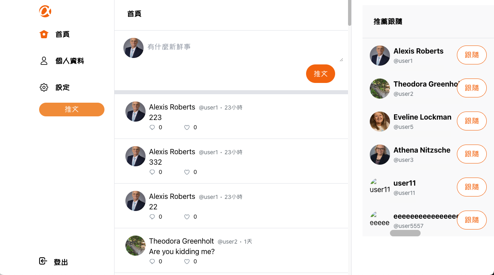

# Alphitter

Alpha Camp驗收專案

## Getting Start

    git clone https://github.com/a88759666/AlphaCamp-twitter.git

    npm install

    npm run start

## Deployment

前往 https://a88759666.github.io/AlphaCamp-twitter

## 指標功能

登入

1. 前台使用 user1 / 12345678 登入
2. 後台使用 root / 12345678 登入

推文

1. 在首頁可以瀏覽全部推文並且點擊推文可以直接前往查看回覆
2. 雙擊發文區塊或是直接在首頁輸入發文資料點擊發文
3. 雙擊回覆圖示可以回覆推文
4. 點擊使用者頭像可前往查看個人資訊

個人頁面

1. 個人頁面可以編輯個人資料
2. 可以編輯登入者設定
3. 可以查看已按過讚的推文、已回覆貼文、已發的推文
4. 可以查看追蹤以及被追蹤的使用者

後台

1. 無法使用一般使用者登入後台
2. 可以查看所有推文並且刪除
3. 可以查看所有使用者

## 開發環境

  * React框架
  * Typescript
  * Tailwind樣式開發

This project was bootstrapped with [Create React App](https://github.com/facebook/create-react-app).

